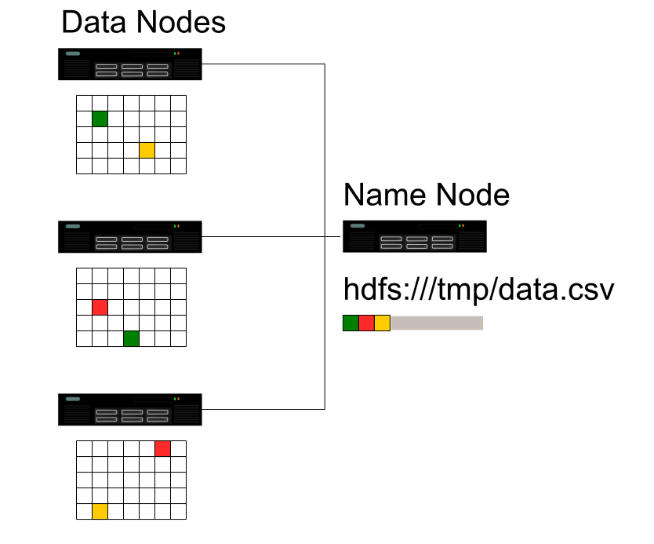
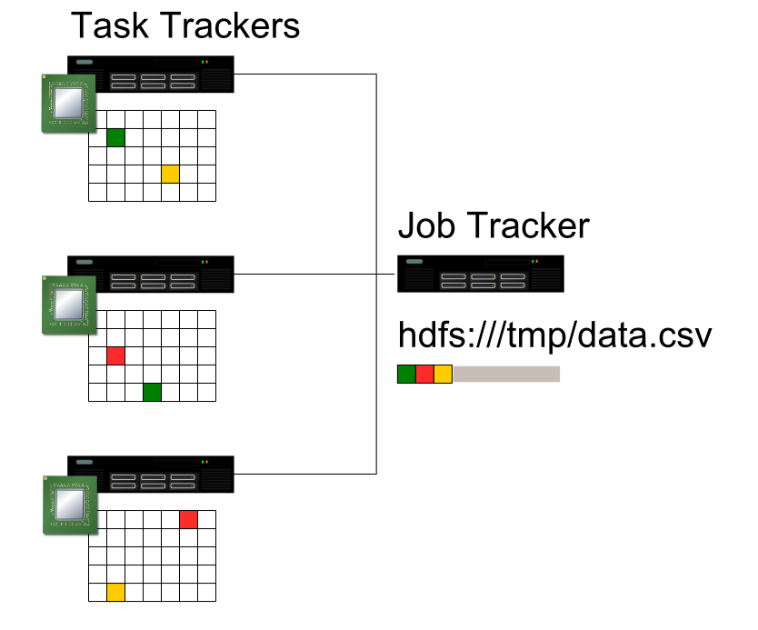

!SLIDE 
# Hadoop #
## Les principes et l'écosystème ##

  <ul>
    <li>Emmanuel Bastien</li>
    <li>Octobre 2011</li>
    <li>RivieraDev</li>
  </ul>

!SLIDE
## Qui parle ? ##
* Emmanuel Bastien (@ebastien)
* Programmeur polyglotte
* Technophile
* Partisan du logiciel libre
* Ingénieur à Amadeus

!SLIDE
## D'après Wikipedia : ##
*Hadoop est un __framework Java libre__ destiné aux applications distribuées et à la __gestion intensive des données__.
Il permet aux applications de travailler avec des milliers de nœuds et des __pétaoctets de données__.
Hadoop a été inspiré par les publications MapReduce, GoogleFS et BigTable de Google.*

!SLIDE
## Quel est le problème ? ##

!SLIDE center

!SLIDE center

!SLIDE center

!SLIDE center

!SLIDE
## Bon vieux terminal... ##
    @@@ sh
                       cat book.txt | \
    tr -s "[:punct:][:space:]" "\n" | \
                               sort | \
                            uniq –c | \
                                cat > wordcounts

!SLIDE
## MapReduce ! ##
    @@@ sh
                       cat book.txt | \
                             MAPPER | \
                               sort | \
                            REDUCER | \
                                cat > wordcounts

!SLIDE
## Tâche "Map" ##
Entrée: une partition des données

Sortie: une collection de paires clé-valeur

!SLIDE
## Tâche "Reduce" ##
Entrée: toutes les valeurs pour une clé

Sortie: résultat final

!SLIDE
## Hadoop Distributed File System ##

!SLIDE center

!SLIDE center

!SLIDE center

!SLIDE
## Interfaces de programmation MapReduce ##

!SLIDE
## API Java ##
* Une classe implémentant l'interface "Mapper"
* Une classe implémentant l'interface "Reducer"
* La définition des entrées et des sorties
* Le code compilé dans un JAR

!SLIDE
## «Word Count», classe Map : ##
    @@@ java
    public void map(
        LongWritable key, Text value,
        OutputCollector<Text, IntWritable> output,
        Reporter reporter) throws IOException {
      
      String line = value.toString();
      StringTokenizer tokenizer = new StringTokenizer(line);
      Text word = new Text();
      IntWritable one = new IntWritable(1);
      
      while (tokenizer.hasMoreTokens()) {
        word.set(tokenizer.nextToken());
        output.collect(word, one);
      }
    }

!SLIDE
## «Word Count», classe Reduce : ##
    @@@ java
    public void reduce(
        Text key,
        Iterator<IntWritable> values,
        OutputCollector<Text, IntWritable> output,
        Reporter reporter) throws IOException {
      
      int sum = 0;
      while (values.hasNext()) {
        sum += values.next().get();
      }
      output.collect(key, new IntWritable(sum));
    }

!SLIDE
## Hadoop Streaming ##
* Un exécutable pour la tâche Map
* Un exécutable pour la tâche Reduce
* La définition des entrées et des sorties

!SLIDE
## «Word Count», tâche Map : ##
    @@@ ruby
    #!/usr/bin/env ruby
    STDIN.each do |line|
      line.scan(/\w+/) do |word|
        STDOUT.puts "#{word}\t1"
      end
    end

!SLIDE
## «Word Count», tâche Reduce : ##
    @@@ ruby
    #!/usr/bin/env ruby
    key, sum = nil, 0
    STDIN.each do |row|
      k, v = row.split "\t"
      if key != k
        STDOUT.puts "#{key}\t#{sum}" if key
        key, sum = k, 0
      end
      sum += v.to_i
    end
    STDOUT.puts "#{key}\t#{sum}" if key

!SLIDE
## Ça peut devenir compliqué... ##

!SLIDE
## Apache Hive ##

!SLIDE
## «Word Count» partiel, Hive : ##
    @@@ sql
    CREATE EXTERNAL TABLE Text(word STRING)
      LOCATION "/samples/words";
    FROM Text
      INSERT OVERWRITE DIRECTORY "/tmp/wordcounts"
      SELECT word, COUNT(word) as totals
      GROUP BY word;

!SLIDE
## Apache Pig ##

!SLIDE
## «Word Count», Pig : ##
    @@@ sh
    lines = LOAD '/samples/book.txt' USING TextLoader();
    words = FOREACH lines GENERATE FLATTEN(TOKENIZE($0));
    grouped = GROUP words BY $0;
    counts = FOREACH grouped GENERATE group, COUNT(words);
    STORE counts INTO '/tmp/wordcounts' USING PigStorage();

!SLIDE
## Cascading ##

!SLIDE
## «Word Count», Cascading/JRuby ##
    @@@ ruby
    cascade 'wordcount' do
      flow 'wordcount' do
        source 'input', tap('/samples/book.txt')
        assembly 'input' do
          each 'line', :function => regex_split_generator(
            'word',
            :pattern => /[.,]*\s+/
          )
          group_by 'word' { count }
          group_by 'count', :reverse => true
        end
        sink 'input', tap('/tmp/wordcounts')
      end
    end.complete(myproperties)

!SLIDE
## Hadoop au-delà d'HDFS ##
* Amazon S3
* FTP et HTTP
* CloudStore

!SLIDE
## Hadoop dans les nuages ##
* Amazon Elastic MapReduce
* Microsoft Windows Azure (bientôt)

!SLIDE
## Evaluer Hadoop chez soi ##
* Machine virtuelle Cloudera pour VirtualBox et KVM
* <a href="http://www.cloudera.com/">http://www.cloudera.com/</a>

!SLIDE
## Références ##
* <a href="http://hadoop.apache.org">http://hadoop.apache.org</a>
* <a href="http://hive.apache.org">http://hive.apache.org</a>
* <a href="http://pig.apache.org">http://pig.apache.org</a>
* <a href="http://github.com/mrwalker/cascading.jruby">http://github.com/mrwalker/cascading.jruby</a>
* <a href="http://www.cloudera.com">http://www.cloudera.com</a>
* <a href="http://aws.amazon.com/fr/elasticmapreduce">http://aws.amazon.com/fr/elasticmapreduce</a>
* <a href="http://www.microsoft.com/windowsazure">http://www.microsoft.com/windowsazure</a>

