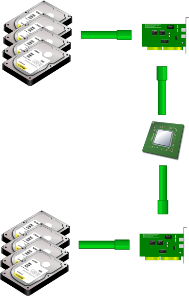

!SLIDE 
# Hadoop #
## Les principes et l'écosystème ##

  <ul>
    <li>Emmanuel Bastien</li>
    <li>Octobre 2011</li>
    <li>RivieraDev</li>
  </ul>

!SLIDE
## Qui parle ? ##
* Emmanuel Bastien (@ebastien)
* Programmeur polyglotte
* Technophile
* Partisan du logiciel libre
* Ingénieur à Amadeus

!SLIDE
## D'après Wikipedia : ##
*Hadoop est un __framework Java libre__ destiné aux applications distribuées et à la __gestion intensive des données__.
Il permet aux applications de travailler avec des milliers de nœuds et des __pétaoctets de données__.
Hadoop a été inspiré par les publications MapReduce, GoogleFS et BigTable de Google.*

!SLIDE
## Quel est le problème ? ##

!SLIDE center

!SLIDE center

!SLIDE center

!SLIDE center

!SLIDE
## Bon vieux terminal... ##
    @@@ sh
    cat input | grep "key" | sort | uniq –c > output

!SLIDE
## MapReduce ! ##
    @@@ sh
    cat input |    Map     | sort | Reduce  > output

!SLIDE
## Tâche "Map" ##
Entrée: une partition des données

Sortie: une collection de paires clé-valeur

!SLIDE
## Tâche "Reduce" ##
Entrée: toutes les valeurs pour une clé

Sortie: résultat final

!SLIDE
## Hadoop Distributed File System ##

!SLIDE center

!SLIDE center

!SLIDE
## Interfaces de programmation MapReduce ##

!SLIDE
## API Java ##
* Une classe implémentant l'interface "Mapper"
* Une classe implémentant l'interface "Reducer"
* La définition des entrées et des sorties
* Le code compilé en JAR

!SLIDE
    @@@ java
    public void map(
        LongWritable key,
        Text value,
        OutputCollector<Text, IntWritable> output,
        Reporter reporter) throws IOException {
      
      String line = value.toString();
      StringTokenizer tokenizer = new StringTokenizer(line);
      Text word = new Text();
      IntWritable one = new IntWritable(1);
      
      while (tokenizer.hasMoreTokens()) {
        word.set(tokenizer.nextToken());
        output.collect(word, one);
      }
    }

!SLIDE
    @@@ java
    public void reduce(
        Text key,
        Iterator<IntWritable> values,
        OutputCollector<Text, IntWritable> output,
        Reporter reporter) throws IOException {
      
      int sum = 0;
      while (values.hasNext()) {
        sum += values.next().get();
      }
      output.collect(key, new IntWritable(sum));
    }

!SLIDE
## Hadoop Streaming ##
* Un exécutable pour la tâche Map
* Un exécutable pour la tâche Reduce
* La définition des entrées et des sorties

!SLIDE
    @@@ ruby
    #!/usr/bin/env ruby
    STDIN.each do |line|
      line.scan(/\w+/) do |word|
        STDOUT.puts "#{word}\t1"
      end
    end

!SLIDE
    @@@ ruby
    #!/usr/bin/env ruby
    key, sum = nil, 0
    STDIN.each do |row|
      k, v = row.split "\t"
      if key != k
        STDOUT.puts "#{key}\t#{sum}" if key
        key, sum = k, 0
      end
      sum += v.to_i
    end
    STDOUT.puts "#{key}\t#{sum}" if key

!SLIDE
## Ça peut devenir compliqué... ##

!SLIDE
## Apache Hive ##

!SLIDE
    @@@ sql
    [exemple de query Hive]

!SLIDE
## Apache Pig ##

!SLIDE
    @@@ sql
    [exemple de word count en Pig]
